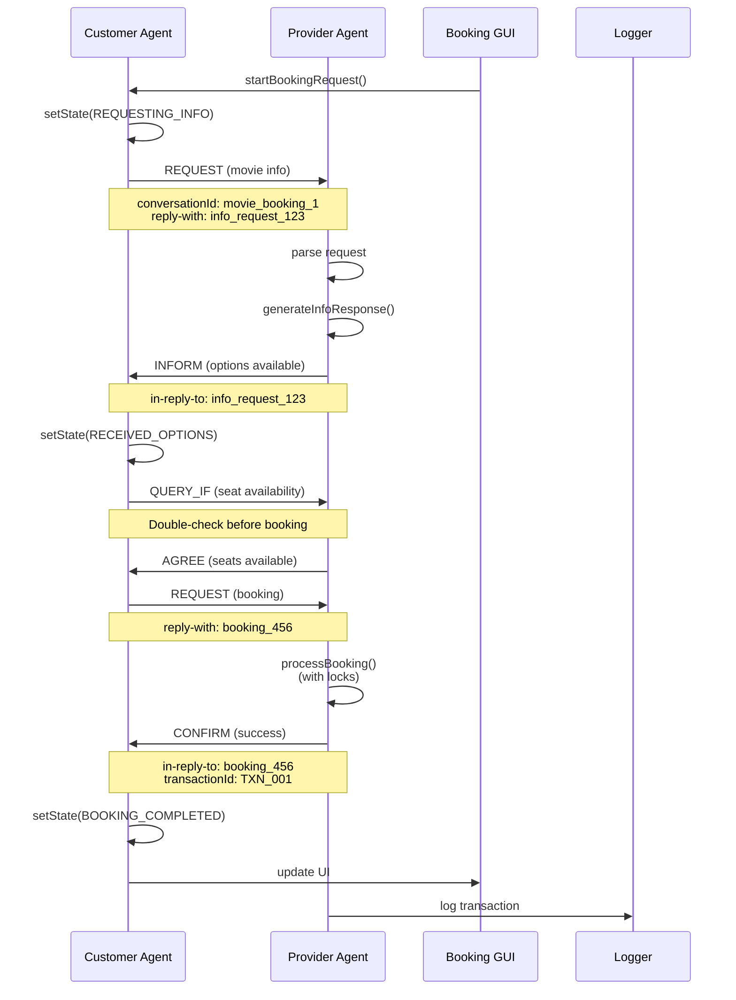
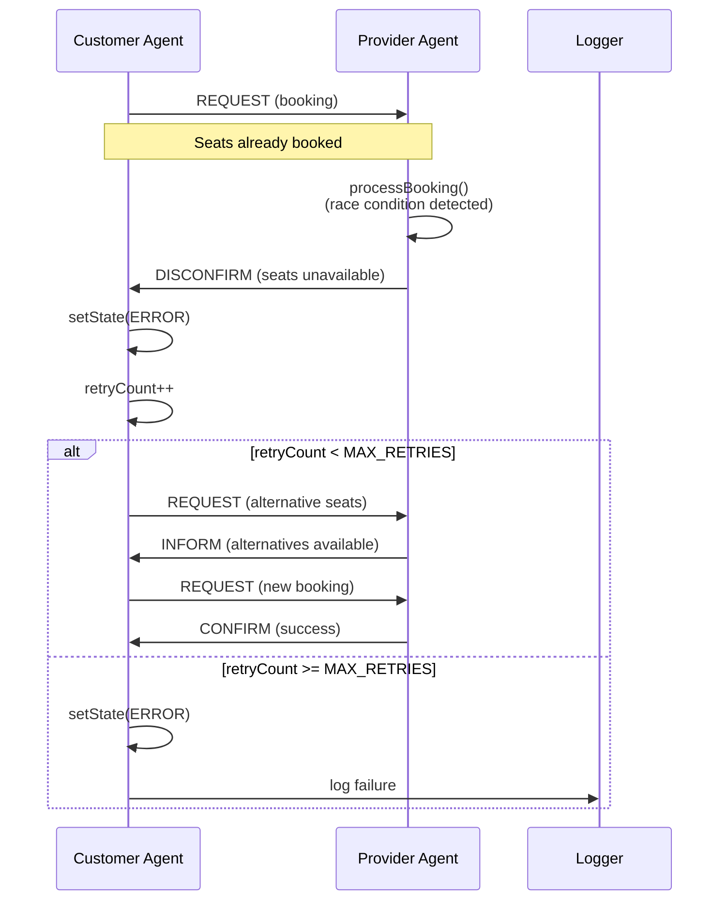
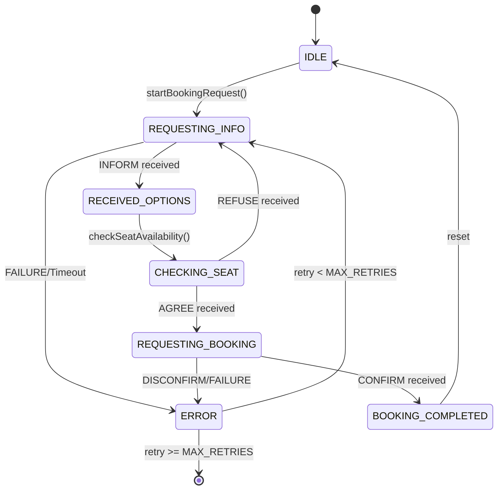

# Multi-Agent Movie Booking System - Architecture Documentation

## System Overview

The Multi-Agent Movie Booking System implements a distributed agent-based architecture using the JADE framework, following FIPA-ACL communication protocols for robust inter-agent communication.

## Architecture Diagram

```
┌─────────────────────────────────────────────────────────────────┐
│                    Multi-Agent Movie Booking System              │
├─────────────────────────────────────────────────────────────────┤
│                                                                 │
│  ┌─────────────────┐    FIPA-ACL     ┌─────────────────┐       │
│  │ Customer Agent  │◄──────────────►│ Provider Agent  │       │
│  │                 │    Messages     │                 │       │
│  │ • State Mgmt    │                 │ • Seat Mgmt     │       │
│  │ • Request Flow  │                 │ • Booking Logic │       │
│  │ • Error Handle  │                 │ • Race Cond.    │       │
│  └─────────────────┘                 └─────────────────┘       │
│           │                                   │                │
│           │                                   │                │
│  ┌─────────────────┐                 ┌─────────────────┐       │
│  │   Booking GUI   │                 │  Main Container │       │
│  │                 │                 │                 │       │
│  │ • User Interface│                 │ • Agent Control │       │
│  │ • Form Validation│                 │ • System Log    │       │
│  │ • Real-time UI  │                 │ • Lifecycle Mgmt│       │
│  └─────────────────┘                 └─────────────────┘       │
│                                                                 │
├─────────────────────────────────────────────────────────────────┤
│                    Shared Components                            │
│                                                                 │
│  ┌─────────────────┐    ┌─────────────────┐                   │
│  │ Movie Booking   │    │ Enhanced Logger │                   │
│  │ Ontology        │    │                 │                   │
│  │                 │    │ • CSV Logging   │                   │
│  │ • Message Schema│    │ • Conversation  │                   │
│  │ • Data Types    │    │   Tracking      │                   │
│  │ • Validation    │    │ • Error Logging │                   │
│  └─────────────────┘    └─────────────────┘                   │
└─────────────────────────────────────────────────────────────────┘
```

## Agent Communication Flow

### Happy Path Sequence



### Error Path Sequence



## State Management

### Customer Agent State Machine



### Provider Agent State Management

The Provider Agent maintains:
- **Seat Inventory**: ConcurrentHashMap with thread-safe operations
- **Booking Locks**: ReentrantReadWriteLock for seat availability
- **Transaction Counter**: AtomicInteger for unique transaction IDs
- **Periodic Checks**: Background thread for seat status monitoring

## FIPA-ACL Protocol Implementation

### Performatives Used

| Performative | Usage | Example |
|-------------|-------|---------|
| REQUEST | Customer requests info/booking | `REQUEST_INFO:Film=Batman...` |
| INFORM | Provider sends information | `Movie: Batman, Available seats: A1(150000)...` |
| CONFIRM | Successful booking confirmation | `Booking berhasil! Transaction ID: TXN_001` |
| DISCONFIRM | Booking failure with reason | `Booking gagal! Kursi tidak tersedia` |
| FAILURE | System error response | `Error: Format pesan tidak dikenali` |
| QUERY_IF | Seat availability check | Double-check before booking |
| AGREE | Seat availability confirmed | Response to QUERY_IF |
| REFUSE | Seat availability denied | Response to QUERY_IF |

### Message Structure

```java
// Request Message
ACLMessage request = new ACLMessage(ACLMessage.REQUEST);
request.addReceiver(new AID("provider", AID.ISLOCALNAME));
request.setConversationId("movie_booking_1");
request.setReplyWith("info_request_1234567890");
request.setContent("REQUEST_INFO:Film=Batman,Date=2025-01-20,Time=19:00,Class=VIP,Tickets=2");

// Response Message
ACLMessage reply = msg.createReply();
reply.setPerformative(ACLMessage.INFORM);
reply.setInReplyTo("info_request_1234567890");
reply.setContent("Movie: Batman, Available VIP seats: A1(150000), A2(150000)...");
```

## Race Condition Handling

### Seat Booking Process

```java
private boolean processBooking(String[] requestedSeats, String seatClass) {
    List<SeatInfo> lockedSeats = new ArrayList<>();
    try {
        // Phase 1: Lock all requested seats
        for (String seatId : requestedSeats) {
            SeatInfo seat = seats.get(seatId);
            if (seat == null) return false;
            
            seat.lock.lock();
            lockedSeats.add(seat);
            
            // Phase 2: Double-check availability
            if (!seat.available) return false;
        }
        
        // Phase 3: Book all seats atomically
        for (SeatInfo seat : lockedSeats) {
            seat.available = false;
        }
        
        return true;
    } finally {
        // Phase 4: Always release locks
        for (SeatInfo seat : lockedSeats) {
            seat.lock.unlock();
        }
    }
}
```

### Locking Strategy

1. **Read Lock**: For seat availability checks
2. **Write Lock**: For seat booking operations
3. **Individual Seat Locks**: For fine-grained control
4. **Timeout Handling**: Prevents deadlocks

## Error Handling & Recovery

### Timeout Management

```java
private class TimeoutBehaviour extends WakerBehaviour {
    public TimeoutBehaviour() { super(EnhancedCustomerAgent.this, 30000); }
    
    @Override
    protected void onWake() {
        if (currentState == AgentState.REQUESTING_INFO ||
            currentState == AgentState.REQUESTING_BOOKING ||
            currentState == AgentState.CHECKING_SEAT) {
            
            retryCount++;
            if (retryCount < MAX_RETRIES) {
                // Retry with exponential backoff
                retryOperation();
            } else {
                setState(AgentState.ERROR);
            }
        }
    }
}
```

### Retry Mechanism

- **Maximum Retries**: 3 attempts
- **Exponential Backoff**: Increasing delay between retries
- **State Recovery**: Return to appropriate state after retry
- **Fallback Options**: Alternative seat suggestions

## Logging System

### CSV Log Format

```csv
timestamp,sender,receiver,performative,conversationId,content,level
2025-01-20 10:30:15,customer,provider,REQUEST,movie_booking_1,REQUEST_INFO:Film=Batman...,INFO
2025-01-20 10:30:16,provider,customer,INFORM,movie_booking_1,Movie: Batman...,INFO
2025-01-20 10:30:20,customer,provider,REQUEST,movie_booking_1,BOOKING:Time=19:00...,INFO
2025-01-20 10:30:21,provider,customer,CONFIRM,movie_booking_1,Booking berhasil!...,INFO
```

### Log Levels

- **INFO**: Normal operations
- **WARNING**: Non-critical issues
- **ERROR**: System errors
- **DEBUG**: Detailed debugging information

## Performance Considerations

### Optimization Strategies

1. **Connection Pooling**: Reuse agent connections
2. **Lazy Loading**: Load seat data on demand
3. **Efficient Locking**: Minimize lock duration
4. **Batch Operations**: Group related operations
5. **Memory Management**: Periodic cleanup of old logs

### Scalability Features

- **Multiple Customer Agents**: Support concurrent users
- **Configurable Inventory**: Easy seat configuration
- **Extensible Ontology**: Add new message types
- **Plugin Architecture**: Modular feature additions

## Security Considerations

### Message Validation

```java
private boolean isValidResponse(ACLMessage msg) {
    return msg.getConversationId() != null && 
           msg.getConversationId().equals(conversationId) &&
           msg.getInReplyTo() != null &&
           msg.getInReplyTo().equals(lastReplyWith);
}
```

### Input Sanitization

- **Content Validation**: Check message format
- **Parameter Validation**: Validate all input parameters
- **SQL Injection Prevention**: Use parameterized queries
- **XSS Prevention**: Sanitize user input

## Testing Strategy

### Unit Tests

- **Agent Behavior Testing**: Test individual agent behaviors
- **Message Handling**: Test FIPA-ACL message processing
- **State Transitions**: Test state machine logic
- **Error Scenarios**: Test error handling paths

### Integration Tests

- **End-to-End Flows**: Test complete booking scenarios
- **Concurrent Access**: Test race condition handling
- **Performance Testing**: Test under load
- **Recovery Testing**: Test error recovery mechanisms

## Deployment Architecture

### Development Environment

```
┌─────────────────┐    ┌─────────────────┐
│   IntelliJ IDEA │    │   Command Line  │
│                 │    │                 │
│ • Debug Mode    │    │ • Batch Scripts │
│ • Hot Reload    │    │ • CI/CD         │
│ • Unit Tests    │    │ • Integration   │
└─────────────────┘    └─────────────────┘
```

### Production Environment

```
┌─────────────────┐    ┌─────────────────┐    ┌─────────────────┐
│   Load Balancer │    │   Application   │    │   Database      │
│                 │    │   Servers       │    │                 │
│ • SSL/TLS       │    │ • JADE Agents   │    │ • Seat Data     │
│ • Health Check  │    │ • GUI Services  │    │ • Logs          │
│ • Failover      │    │ • API Gateway   │    │ • Analytics     │
└─────────────────┘    └─────────────────┘    └─────────────────┘
```

## Future Enhancements

### Planned Features

1. **Database Integration**: Persistent storage
2. **Web Interface**: REST API and web dashboard
3. **Payment Gateway**: Integrated payment processing
4. **Notification System**: Email/SMS confirmations
5. **Analytics Dashboard**: Booking statistics and reports
6. **Mobile App**: Native mobile application
7. **Real-time Updates**: WebSocket connections
8. **Multi-language Support**: Internationalization

### Technical Improvements

1. **Microservices Architecture**: Service decomposition
2. **Message Queue**: RabbitMQ/Apache Kafka
3. **Containerization**: Docker support
4. **Cloud Deployment**: AWS/Azure integration
5. **Monitoring**: Prometheus/Grafana
6. **Logging**: ELK Stack integration
7. **Caching**: Redis for performance
8. **API Gateway**: Kong/AWS API Gateway

## Conclusion

The Multi-Agent Movie Booking System demonstrates a robust implementation of FIPA-ACL protocols with comprehensive error handling, state management, and race condition prevention. The architecture supports scalability and maintainability while providing a solid foundation for future enhancements.
